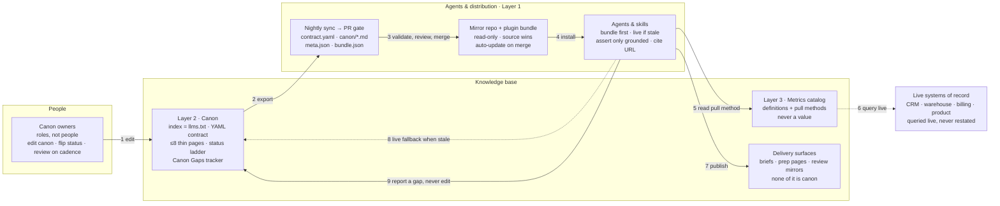
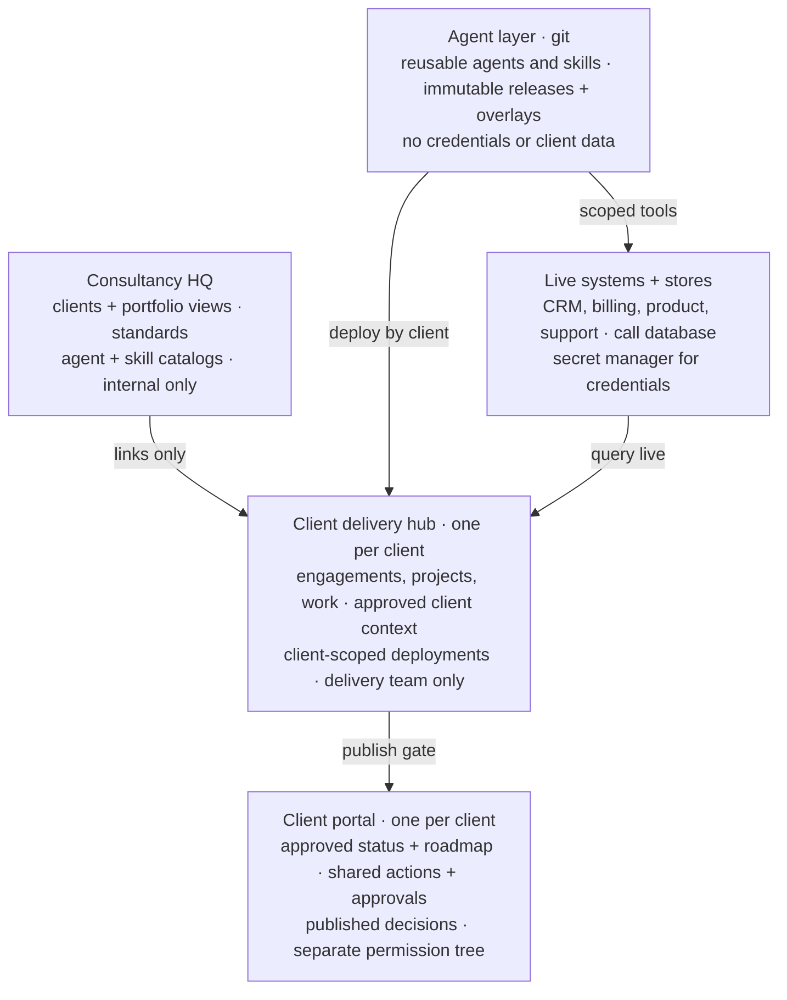
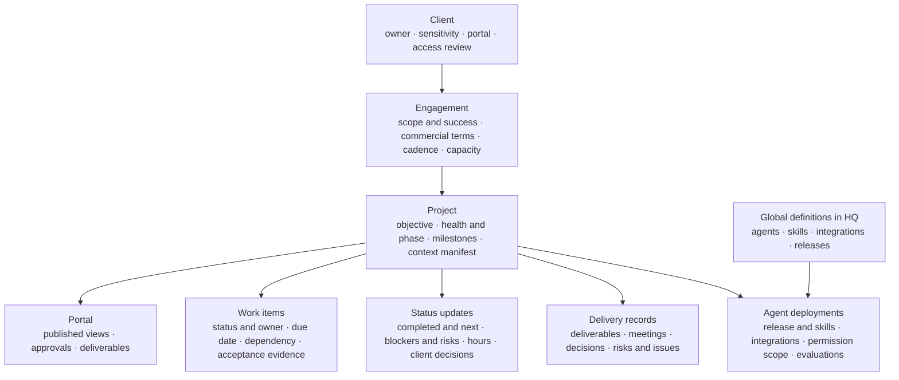
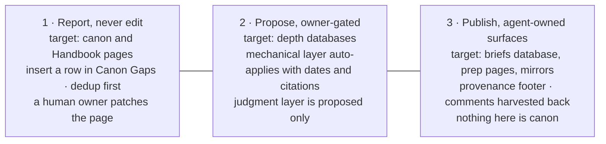
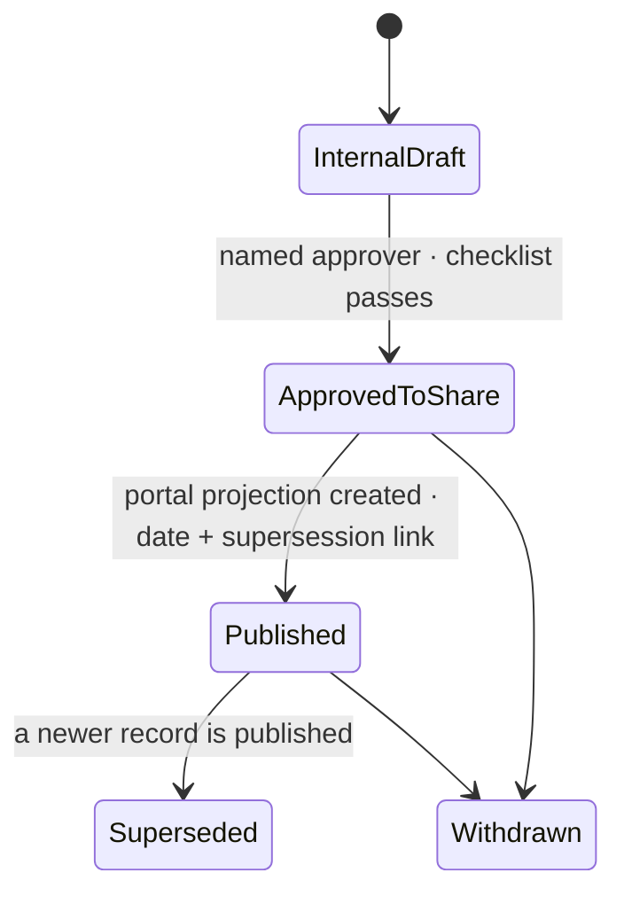

# Diagrams

Mermaid renders on GitHub. Each diagram matches a section of `01-business-pattern.md` or `02-consultancy-pattern.md`.

## 1. Business pattern: the architecture on one page

## 2. Consultancy pattern: hub and spoke with hard client boundaries

Repeat the hub and the portal for every client. Use a separate or client-owned workspace when a contract, regulation or security review requires it.

## 3. Project tracking is the operating spine

Each operational record resolves to one client and one engagement. Only records approved for sharing are published into the portal.

## 4. Three write paths, by risk to company truth

Lower risk to company truth on the left; higher agent autonomy on the right. The one hard rule: the agent proposes; the owner verifies.

## 5. Publishing gate (consultancy)

